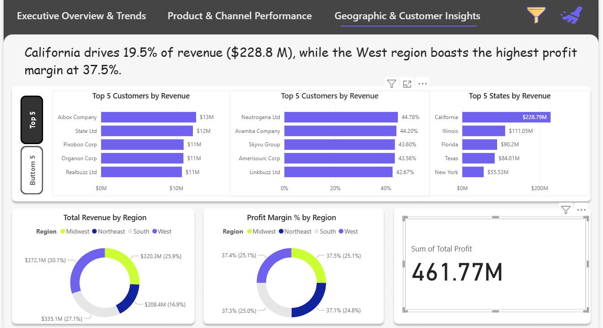

# Regional Sales Analysis (Exploratory Data Analysis)

[Repository](https://github.com/krishnamurthi-ramesh/Sales-Analysis-Data-Analysis) • Author: **Krishnamurthi**

## Overview
This repository contains an Exploratory Data Analysis (EDA) project on regional sales data. The goal is to analyze sales trends, identify high-performing regions and products, and surface actionable insights through visualizations and summary statistics.

[](LICENSE)

## Project Highlights
- Interactive Jupyter Notebook that walks through the complete EDA process
- Data cleaning and validation steps
- Visualizations to spot trends, seasonality, and performance by region/product
- Exported charts and summary tables for quick reporting

## Repository Structure
- `EDA_Regional_Sales_Analysis.ipynb` — Main Jupyter notebook with EDA, charts, and insights
- `Sales_data(EDA Exported).csv` — Dataset used for analysis
- `Background/` — Supporting documentation and any additional data or analysis notes
- `README.md` — This file

## Project Status 

- Status: Active — exploratory analyses are complete and additional visualizations and features may be added.
- Notebook last reviewed: 2025-12-02

## Reproducibility & Exports 

This repository contains a Jupyter Notebook. To reproduce the analyses and export the final report/visualizations programmatically, follow the steps below.

1. Make sure you have a Python environment and required packages installed (see Quick Start).
2. Re-run the notebook and, if you'd like, export it to HTML or PDF:

```pwsh
jupyter nbconvert --to html EDA_Regional_Sales_Analysis.ipynb --output report.html
```

Or convert to PDF (system requirements depend on the PDF generator tool like pandoc or wkhtmltopdf):

```pwsh
jupyter nbconvert --to pdf EDA_Regional_Sales_Analysis.ipynb --output report.pdf
```

## Suggested Requirements

If you don't have a `requirements.txt` file, create one from your current environment for reproducibility:

```pwsh
pip freeze > requirements.txt
```

Add the usual packages used in the notebook, for example:

```text
pandas
numpy
matplotlib
seaborn
plotly
jupyter
```

## Live Dashboard 🚀

The interactive dashboard for the sales analysis is hosted and available here:
 
[Live Dashboard (SharePoint)](https://iimv1-my.sharepoint.com/:u:/g/personal/krishnamurthi_ramesh25-07_iimv_ac_in/IQA8DeIgmvIpQ44KwTziNdHgAaeP7f_X5k5cf-4N8TDw-KM?e=HdnOZ9)

This link points to the live SharePoint-hosted dashboard. Note: You can preview the dashboard using any Microsoft account (sign-in required).

## Dashboard Preview (Screenshots) 📸

Here are preview screenshots of the dashboard to provide a quick visual overview. Click the "Live Dashboard" link above to open the interactive version (Microsoft account sign-in required).

<table>
	<tr>
		<td align="center"><br/><strong>Executive Overview & Trends</strong></td>
		<td align="center"><br/><strong>Product & Channel Performance</strong></td>
		<td align="center"><br/><strong>Geographic & Customer Insights</strong></td>
	</tr>
</table>

## Dataset
The dataset used for analysis is `Sales_data(EDA Exported).csv`. It contains historical sales records, including columns for region, product, sales volume, unit price, date, and any other features discovered during initial cleaning.

## Quick Start (Windows / PowerShell)
1. (Optional but recommended) Create a Python virtual environment:

```pwsh
python -m venv .venv
.\.venv\Scripts\Activate.ps1
```

2. Install required packages (example):

```pwsh
pip install -r requirements.txt
```

If `requirements.txt` is not provided, install the basic packages:

```pwsh
pip install pandas numpy matplotlib seaborn plotly jupyter
```

3. Start Jupyter Notebook / Lab and open the notebook:

```pwsh
jupyter notebook EDA_Regional_Sales_Analysis.ipynb
# or
jupyter lab
```

## What you'll find in the Notebook
- Data loading and initial exploration
- Data cleaning and type conversions
- Descriptive statistics (mean, median, counts, etc.)
- Visualizations:
	- Sales over time
	- Regional performance
	- Top-selling products
	- Monthly/quarterly trends
- Key takeaways and suggested next steps

## Contributing
Contributions are welcome! For details on how to contribute, please read `CONTRIBUTING.md`.

Some ways you can help:
- Add a new visualization or analysis in the notebook
- Propose data cleaning or pipeline improvements
- Create an issue or pull request with suggested changes or bug fixes
- Add or update `requirements.txt` for reproducibility

Please follow the contribution guidelines in `CONTRIBUTING.md` when making changes.

## License
This repository is provided under the MIT License. See `LICENSE` for full details. By contributing, you agree to license your contributions under MIT as described in `CONTRIBUTING.md`.

## Contact
If you have any questions or suggestions, open an issue or reach out to the project owner.

Author: **Krishnamurthi** — GitHub: [krishnamurthi-ramesh](https://github.com/krishnamurthi-ramesh)

---

Thank you for checking out this project — feel free to explore and contribute!


